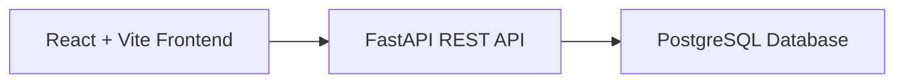
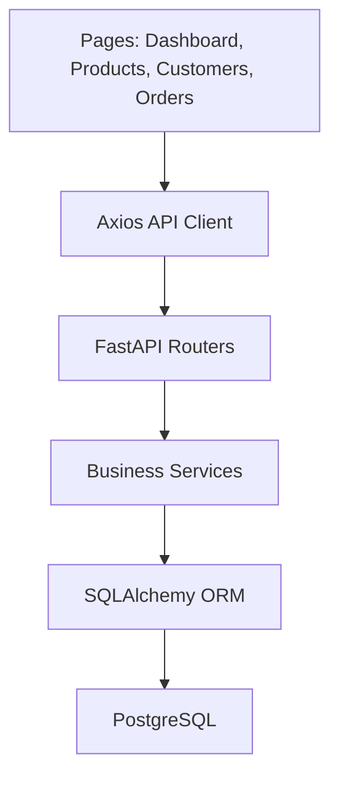
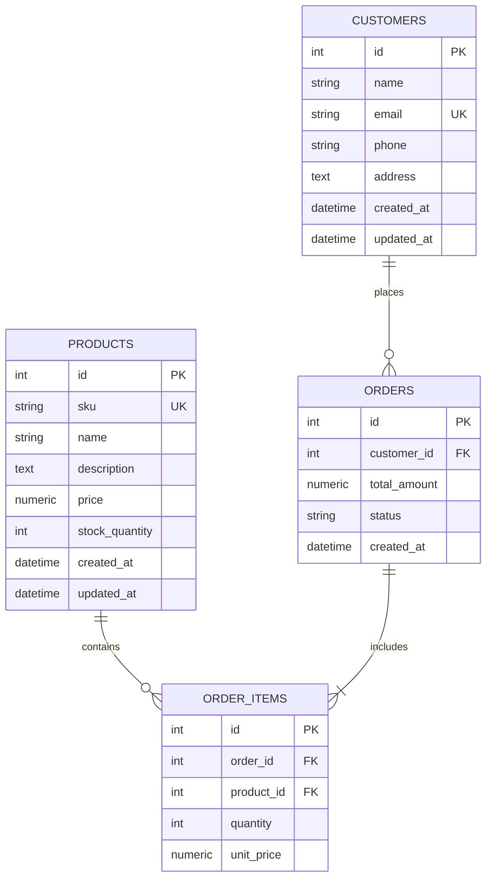
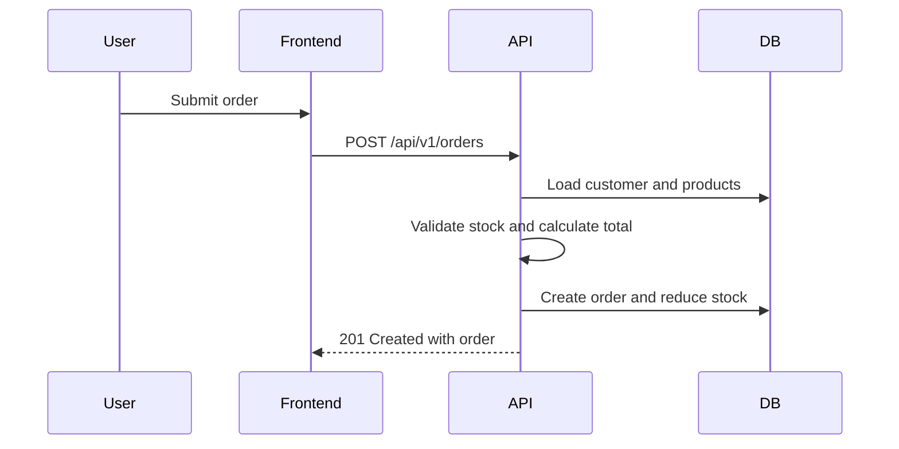

# Architecture

## High-Level Architecture

## Component Diagram

## Database ER Diagram

## API Flow

## Architecture Decisions

- FastAPI provides built-in OpenAPI documentation and strong validation through Pydantic.
- SQLAlchemy keeps persistence logic explicit and portable.
- Alembic manages schema changes for PostgreSQL.
- React Router keeps frontend sections simple and reviewable.
- Docker Compose mirrors the production service split for local verification.

